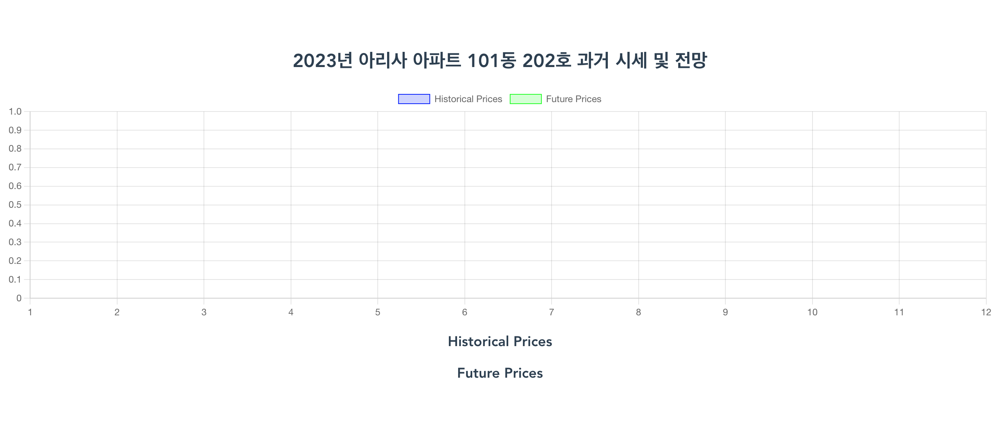
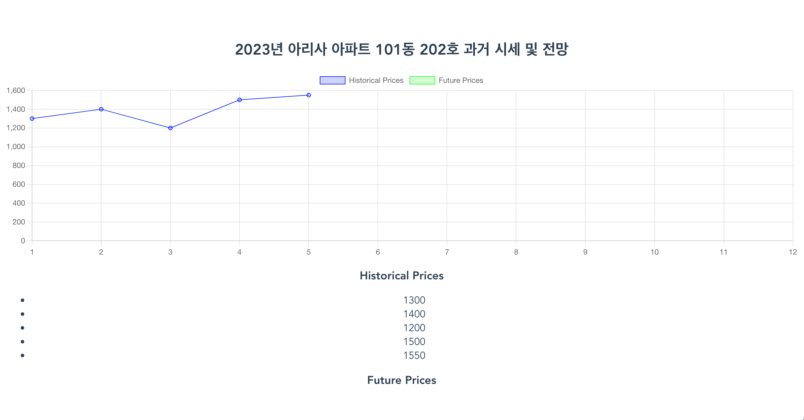
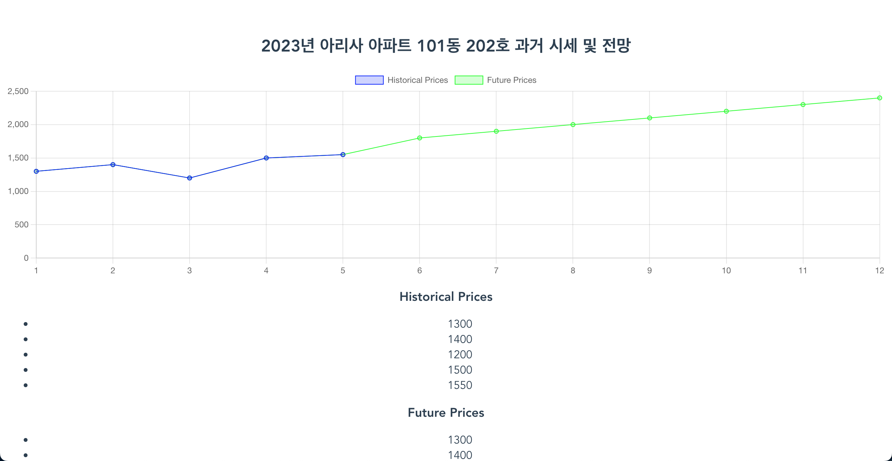

# aresa-app

1. 개발 환경 세팅 방식 
    1. Database 설치 과정 기술: 
        * sqlite3 설치:
        ```bash
        npm install sqlite3
        ```

    2. Frontend 설치 command: 
        * Vue CLI 설치:
        ```bash
        npm install -g @vue/cli
        ```
        * Vue 프로젝트 생성:
        ```bash
        vue create aresa-app
        ```
        1. "Manually select features" 옵션을 선택합니다.
        2. 다음으로 진행하여 사용할 기능을 선택합니다. 여기서는 "Babel", "Router", "Vuex", "CSS Pre-processors", "Linter / Formatter"를 선택합니다. 선택을 완료하고 Enter 키를 눌러 진행합니다.
        3. "Use history mode for router?"라는 질문에는 "Yes"를 선택합니다.
        4. CSS Pre-processors에서는 "Sass/SCSS (with dart-sass)"를 선택합니다.
        5. Linter / Formatter에서는 "ESLint + Prettier"를 선택합니다.
        6. "Save this as a preset for future projects?"라는 질문에는 "No"를 선택합니다.
        
        * 프로젝트 폴더로 이동:
        ```bash
        cd aresa-app
        ```
        
    3. Backend 설치 command: 
        * 다음 명령어로 백엔드 파일과 폴더를 생성합니다.:
        ```bash
        mkdir src/routes
        touch src/routes/aresa-api.js
        touch src/server.js
        ```
        
        * Node.js 웹 애플리케이션 프레임워크입니다. 다음 명령어로 설치할 수 있습니다: 
        ```bash
        npm install express
        ```

        * HTTP 요청의 body를 파싱하는 미들웨어입니다. Express.js와 함께 사용하기 위해 설치합니다: 
        ```bash
        npm install body-parser
        ```
        
        * HTTP 클라이언트 라이브러리로, 서버와의 HTTP 요청을 보내기 위해 사용합니다: 
        ```bash
        npm install axios
        ```        
        
    4. Database 테이블 생성 sql: 
        * 아파트(Apartment) 테이블 생성 SQL:
        ```sql
        CREATE TABLE Apartment (
          id INT PRIMARY KEY AUTO_INCREMENT,
          name VARCHAR(255) NOT NULL,
          address VARCHAR(255) NOT NULL
        );
        ```

        * 가격(Price) 테이블 생성 SQL:
        ```sql
        CREATE TABLE Price (
          id INT PRIMARY KEY AUTO_INCREMENT,
          apartment_id INT NOT NULL,
          year INT NOT NULL,
          month INT NOT NULL,
          price DECIMAL(10, 2) NOT NULL,
          FOREIGN KEY (apartment_id) REFERENCES Apartment(id)
        );
        ```

2. 서비스 실행 방식 
    1. Frontend 실행 command: 
        * 프론트엔드 의존성 설치:
        ```bash
        npm install
        ```
        
        * 프론트엔드 실행:
        ```bash
        npm run serve
        ```

    2. Backend 실행 command: 
        * 백엔드 의존성 설치:
        ```bash
        cd src
        npm init -y
        npm install express mysql body-parser cors --save
        ```
        
        * 백엔드 실행:
        ```bash
        node src/server.js
        ```
        
3. 예제 실행 Step 별 화면 변경사항 
    1. DB에 아무 정보 없을 때 화면: 
        

    2. POST historical_price 에 임의의 값 post 
        1. post curl 커멘드: 
            * curl post historical_prices:
            ```bash
            curl -X POST -H "Content-Type: application/json" -d '{
              "aptId": 101,
              "year": 2023,
              "monthStart": 1,
              "values": [1300, 1400, 1200, 1500, 1550]
            }' http://localhost:3000/aresa-api/historical_prices
            ```
            
        2. post 이후 새로고침 화면: 
        
        
    3. POST futurel_price 에 임의의 값 post 
        1. post curl 커멘드: 
            * curl post future_prices:
            ```bash
            curl -X POST -H "Content-Type: application/json" -d '{
              "aptId": 101,
              "year": 2023,
              "monthStart": 1,
              "values": [1300, 1400, 1200, 1500, 1550, 1800, 1900, 2000, 2100, 2200, 2300, 2400]
            }' http://localhost:3000/aresa-api/future_prices
            ```
            
        2. post 이후 새로고침 화면: 
        
